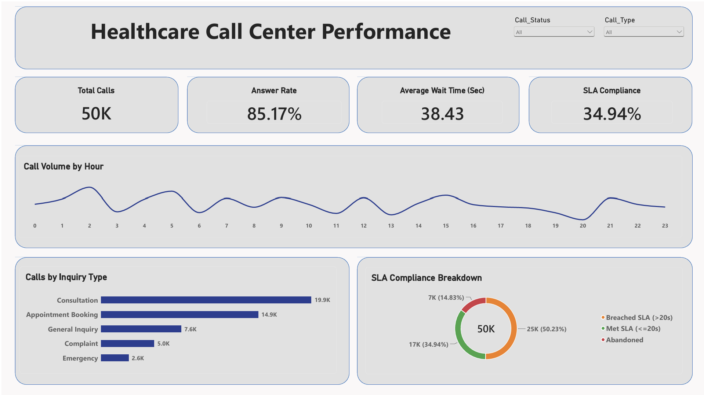

# Healthcare Call Center Analytics: End-to-End Data Pipeline

## 📌 Project Overview
This project simulates a real-world healthcare call center (similar to 937 operations). The goal was to build a complete end-to-end data pipeline starting from synthetic data generation to database management, and finally, data visualization. 

## 🛠️ Tech Stack
* **Python (pandas, numpy, pyodbc):** Engineered and generated 50,000 realistic call records utilizing statistical distributions (Gamma distribution for wait/talk times).
* **SQL Server:** Managed database architecture and executed optimized queries for data transformation and SLA categorization.
* **Power BI:** Designed an interactive, executive-level dashboard using semantic colors to track core KPIs.

## ⚙️ Data Pipeline Steps
1. **Data Generation:** Developed a Python script to generate a 50K-record dataset containing `Call_ID`, `Call_Timestamp`, `Call_Type`, `Call_Status`, `Wait_Time_Sec`, `Talk_Time_Sec`, and `Agent_Name`.
2. **Database Integration:** Bypassed standard SQLAlchemy limitations by using `pyodbc` with `fast_executemany` for rapid bulk insertion into a local SQL Server database.
3. **Data Modeling & Visualization:** Connected Power BI directly to SQL Server using a custom master query to classify SLA compliance dynamically before visualizing the insights.

## 📊 Key Insights & KPIs
* **Total Calls:** 50K calls processed over a 6-month simulated period.
* **Answer Rate:** Maintained an 85.17% answer rate.
* **SLA Compliance:** Tracked the percentage of calls answered within the target threshold (<= 20 seconds).
* **Peak Hours:** Identified call volume trends throughout the day to optimize agent allocation.

## 🖼️ Dashboard Preview

*(Note: Replace the image name above with your actual uploaded image file name in GitHub)*
